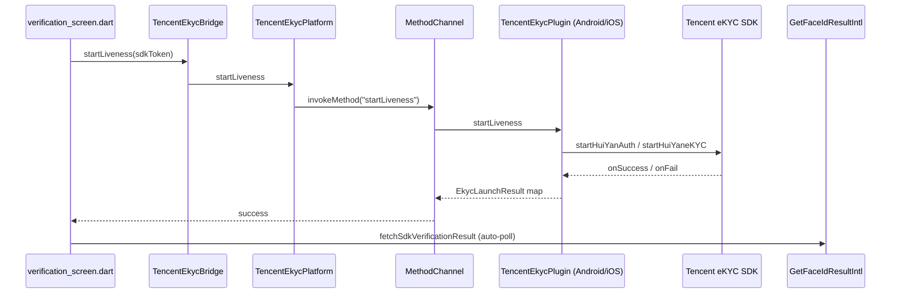

# Face Verification Compare

A Flutter app for comparing face **verification / liveness** APIs from multiple cloud providers. Integrates **Tencent Cloud FaceID (1061)**, **Baidu AI**, and **Aliyun CloudAuth PV_FV H5** with an extensible provider architecture.

> **Demo mode only — not production-safe**
>
> This app calls Tencent Cloud APIs **directly from the Flutter client** using SecretId/SecretKey loaded from `.env`. Anyone who decompiles or inspects the app bundle can extract those credentials. Use this setup **only for local testing and API comparison**. For production, proxy requests through a backend that holds secrets server-side.

## Prerequisites

- Flutter SDK 3.8+ (`flutter --version`)
- A Tencent Cloud account with [FaceID / eKYC (1061)](https://www.tencentcloud.com/document/product/1061) enabled
- API credentials (SecretId / SecretKey) from [CAM Console](https://console.cloud.tencent.com/cam/capi)

## Setup

1. **Clone / open the project**

   ```bash
   cd /Users/yyu/StudioProjects/FaceDetection
   ```

2. **Configure credentials**

   ```bash
   cp .env.example .env
   ```

   Edit `.env` and set:

   | Variable | Description |
   |----------|-------------|
   | `TENCENT_SECRET_ID` | Your Tencent Cloud SecretId |
   | `TENCENT_SECRET_KEY` | Your Tencent Cloud SecretKey |
   | `TENCENT_REGION` | Region, e.g. `ap-singapore` (intl CompareFaceLiveness) |
   | `TENCENT_FACEID_HOST` | `faceid.intl.tencentcloudapi.com` (intl) or `faceid.tencentcloudapi.com` (China) |
   | `TENCENT_FACEID_LIVENESS_TYPE` | `SILENT` or `ACTION` for pure-API flow |
   | `TENCENT_FACEID_SECURE_LEVEL` | SaaS SDK secure level (1–4), default `4` |
   | `TENCENT_FACEID_SDK_VERSION` | SaaS SDK version: `BASIC`, `ENHANCED`, `PRO`, `PLUS` |
   | `TENCENT_FACEID_RULE_ID` | Optional RuleId for domestic APIs / H5 |
   | `TENCENT_FACEID_H5_REDIRECT_URL` | H5 callback URL (Tencent appends `?token={BizToken}`) |
   | `TENCENT_FACEID_H5_AUTO_SKIP` | `true` to set H5 `Config.AutoSkip` (skip result page) |
   | `BAIDU_API_KEY` | Baidu AI API Key (face verification) |
   | `BAIDU_SECRET_KEY` | Baidu AI Secret Key |
   | `BAIDU_MATCH_THRESHOLD` | Face 1:1 match pass score (default `80`) |
   | `BAIDU_LIVENESS_THRESHOLD_KEY` | Video liveness threshold key: `frr_1e-3` etc. |
   | `BAIDU_LIVENESS_CONTROL` | `NONE` / `LOW` / `NORMAL` / `HIGH` for live image in match |
   | `BAIDU_QUALITY_CONTROL` | Quality control for match images |
   | `BAIDU_FACEPRINT_PLAN_ID_DAZZLE` | H5 plan: 炫瞳活体 (default `26109`) |
   | `BAIDU_FACEPRINT_PLAN_ID_NEAR_FAR` | H5 plan: 远近活体 (default `26110`) |
   | `BAIDU_FACEPRINT_PLAN_ID_ACTION` | H5 plan: 动作活体 (default `26111`) |
   | `BAIDU_FACEPRINT_PLAN_ID_SILENT` | H5 plan: 静默活体 (default `26112`) |
   | `BAIDU_FACEPRINT_H5_CALLBACK_URL` | H5 WebView redirect base |
   | `ALIYUN_ACCESS_KEY_ID` | Aliyun RAM AccessKey ID (CloudAuth) |
   | `ALIYUN_ACCESS_KEY_SECRET` | Aliyun RAM AccessKey Secret |
   | `ALIYUN_CLOUDAUTH_SCENE_ID` | CloudAuth console SceneId (Long) |
   | `ALIYUN_CLOUDAUTH_REGION_ID` | RPC RegionId (default `cn-shanghai`) |
   | `ALIYUN_CLOUDAUTH_RETURN_URL` | H5 ReturnUrl (Aliyun appends `?response=` JSON) |
   | `ALIYUN_CLOUDAUTH_MODEL` | InitFaceVerify Model (default `MOVE_ACTION`) |
   | `ALIYUN_CLOUDAUTH_CALLBACK_URL` | Server callback URL (default `https://www.aliyun.com`) |
   | `ALIYUN_CLOUDAUTH_VOLUNTARY_CUSTOMIZED_CONTENT` | Willingness agreement JSON array |
   | `ALIYUN_CLOUDAUTH_SOURCE_IP` | End-user IP sent as `SourceIp` |
   | `ALIYUN_CLOUDAUTH_METAINFO_OVERRIDE` | Optional static MetaInfo (Explorer testing; skips WebView) |
   | `ALIYUN_CLOUDAUTH_CERTIFY_URL_TYPE` | Optional `H5` to request `CertifyUrl` for WebView liveness |
   | `ALIYUN_CLOUDAUTH_USER_ID` | Custom UserId for InitFaceVerify |
   | `ALIYUN_MATCH_THRESHOLD` | verifyScore pass threshold (default `70`) |

   **Never commit `.env`** — it is listed in `.gitignore`.

3. **Install dependencies**

   ```bash
   flutter pub get
   ```

4. **Run on a physical Android device or emulator with camera**

   ```bash
   flutter run
   ```

   Grant **Camera** and **Photos** permissions when prompted. On first launch, copy `.env.example` → `.env` before running if you have not already.

## Android permissions

The app declares `INTERNET`, `CAMERA`, `READ_MEDIA_IMAGES`, `READ_MEDIA_VIDEO`, and legacy storage access for gallery picks. Runtime permissions are requested before camera/gallery use.

## Usage

Select a **Provider** (Tencent FaceID, Baidu AI, or Aliyun CloudAuth), then follow the flow steps for your chosen integration.

### Aliyun CloudAuth SaaS H5 (PV_FV — liveness + face contrast)

1. Select **Aliyun CloudAuth** → automatically switches to **SaaS H5** flow.
2. Pick a **liveness model** tab: 静默 / 眨眼 / 炫彩 / 动作 / 远近 / 多炫彩 (InitFaceVerify `Model`).
3. Upload reference photo → tap **Request H5 session** — loads `getMetaInfo()` via Aliyun JS (or set `ALIYUN_CLOUDAUTH_METAINFO_OVERRIDE` for Explorer-style testing), then calls `InitFaceVerify` with `FaceContrastPicture`, `CallbackUrl`, `SourceIp`, etc.
4. Tap **Start H5 Liveness** — opens `CertifyUrl` in WebView (requires `ALIYUN_CLOUDAUTH_CERTIFY_URL_TYPE=H5`; minimal Explorer requests may return `CertifyId` only).
5. After ReturnUrl redirect (`?response=` JSON), **Run verification** → `DescribeFaceVerify`.

> **Console setup:** Enable [金融级实人认证](https://help.aliyun.com/zh/id-verification/financial-grade-id-verification/), create a **PV_FV** scene with custom face contrast source, grant RAM user `AliyunAntCloudAuthFullAccess`.

> **Docs:** [H5 接入流程](https://help.aliyun.com/zh/id-verification/financial-grade-id-verification/liveness-integration-process-6), [InitFaceVerify](https://help.aliyun.com/zh/id-verification/financial-grade-id-verification/face-liveness-verification-websdk-server-side-integration), [DescribeFaceVerify](https://help.aliyun.com/zh/id-verification/financial-grade-id-verification/describefaceverify-1)

### Baidu Pure API (face match + video liveness)

1. Select **Baidu AI** as provider → **Pure API** flow.
2. **Step 1:** Upload reference photo (基准图).
3. **Step 2:** Record live face video (2–6 seconds, MP4).
4. **Step 3:** Tap **Run verification** — calls:
   - `POST /rest/2.0/face/v1/faceliveness/verify` — silent video liveness, returns `best_image`
   - `POST /rest/2.0/face/v3/match` — 1:1 compare reference vs live best frame
5. View match score (threshold 80), liveness score, pass/fail, latency.

> **Baidu credentials:** [Baidu AI Console](https://console.bce.baidu.com/ai/#/ai/face/overview/index) — enable **video liveness** and **face match** (V3).

### Baidu SaaS H5 (faceprint — real-time liveness in WebView)

1. Select **Baidu AI** → **SaaS H5** flow.
2. Pick a **liveness method** tab: 炫瞳 / 远近 / 动作 / 静默 (each uses its own `plan_id`).
3. Upload reference photo → tap **Request H5 session** (`verifyToken/generate` + `uploadMatchImage`).
4. Tap **Start H5 Liveness** — opens `brain.baidu.com/face/print` in WebView.
5. After redirect, **Run verification** → `result/detail`.

> **Console setup:** Create four **H5 实名认证方案** (比对源: **与上传照片比对**), one per liveness type. Map IDs in `.env` (`BAIDU_FACEPRINT_PLAN_ID_*`) or use defaults `26109`–`26112`.

> **Docs:** [H5 接入指南](https://ai.baidu.com/ai-doc/FACE/Elyij68mb), [H5 接口文档](https://ai.baidu.com/ai-doc/FACE/Xkxie8338)

### Tencent Face Verification (FaceID)

### Pure API flow (default, works without Tencent SDK)

1. Select **Pure API** flow.
2. **Step 1:** Pick a reference photo (基准图) from gallery. Large photos are auto-compressed to Tencent's 3 MB Base64 limit.
3. **Step 2:** Tap **Open camera & record** — in-app front camera records 2–6 seconds of live face video (MP4).
4. **Step 3:** Tap **Run verification** — calls `CompareFaceLiveness` (intl) or `LivenessCompare` (domestic).
5. View results: match pass/fail, liveness pass/fail, similarity score, result code, latency, request ID.

> **Tips:** Use the same person in both photo and video, good lighting, and face the front camera. If video upload fails with size errors, re-record a shorter clip.

### SaaS H5 flow (recommended — Mobile HTML5 liveness)

1. Select **SaaS H5** flow.
2. Upload reference photo → tap **Request H5 session** (`ApplyWebVerificationBizTokenIntl` with `CompareImageBase64`).
3. Tap **Start H5 Liveness** — opens Tencent's `VerificationURL` in an in-app WebView.
4. Complete liveness in the H5 page. When finished, Tencent redirects to your `RedirectURL` with `?token={BizToken}`; the app intercepts this URL and closes the WebView.
5. The app automatically calls **GetWebVerificationResultIntl** (`ErrorCode=0` = pass).
6. You can tap **Run verification** to re-poll results.

> **Console setup:** Enable **Selfie Verification (Mobile HTML5)** in the [eKYC console](https://www.tencentcloud.com/document/product/1061/55995). Set `TENCENT_FACEID_H5_REDIRECT_URL` in `.env` to any HTTPS URL (default `https://facedetection.local/liveness/callback`) — no real server is required; the WebView intercepts the redirect.

> **Docs:** [H5 integration process](https://www.tencentcloud.com/document/product/1061/55995), [ApplyWebVerificationBizTokenIntl](https://www.tencentcloud.com/document/product/1061/56227), [GetWebVerificationResultIntl](https://www.tencentcloud.com/document/product/1061/56226)

### SaaS Native SDK flow (optional — Platform Channel)

1. Select **Native SDK** flow.
2. Upload reference photo → tap **Request SdkToken** (`GetFaceIdTokenIntl` with `CheckMode=compare`).
3. Tap **Start Liveness** — opens the native Tencent eKYC SDK via Platform Channel (`com.facedetection/tencent_ekyc`).
4. After liveness succeeds, the app automatically polls **GetFaceIdResultIntl** for similarity, liveness result, etc.
5. You can also tap **Run verification** manually to re-poll results.

> **Native SDK required:** Drop Tencent eKYC binaries into the Android/iOS projects (see [Tencent eKYC SDK integration](#tencent-ekyc-sdk-integration)). Without them, `isAvailable` returns `false` and the UI shows a clear message.

## Project Structure

```
lib/
  main.dart
  models/
    baidu_h5_liveness_method.dart
    aliyun_h5_liveness_method.dart
    face_verification_result.dart
    verification_metrics.dart
  services/
    face_verification_provider.dart
    aliyun/
      aliyun_cloudauth_api_client.dart
      aliyun_h5_service.dart
      aliyun_face_verification_service.dart
      aliyun_face_verification_response_parser.dart
    baidu/
      baidu_auth_client.dart
      baidu_api_client.dart
      baidu_h5_service.dart          # H5 URL + callback helpers
      baidu_face_verification_service.dart
      baidu_face_verification_response_parser.dart
    tencent/
      tencent_api_client.dart      # TC3-HMAC-SHA256 signed HTTP client
      tencent_ekyc_bridge.dart     # High-level bridge to native eKYC SDK
      tencent_h5_service.dart      # H5 redirect/callback parsing
      tencent_face_id_service.dart # FaceID 1061 implementation
      tencent_face_id_response_parser.dart
  screens/
    verification_screen.dart
    h5_liveness_screen.dart        # WebView for H5 liveness (Tencent/Baidu/Aliyun)
    live_capture_screen.dart       # In-app front-camera video capture
  utils/
    aliyun_metainfo_bootstrap.dart # MetaInfo WebView HTML + timing constants
    aliyun_rpc_signer.dart         # Aliyun RPC HMAC-SHA1 signature
    aliyun_trace.dart              # Aliyun API trace logging
    provider_trace.dart            # Shared HTTP trace (Tencent / Baidu)
    tc3_signer.dart                # Tencent Cloud API v3 signature
    app_config.dart                # .env credential loader
    media_utils.dart               # Image/video size validation & compression
    permission_utils.dart          # Camera & gallery runtime permissions

android/app/src/main/kotlin/.../
  TencentEkycPlugin.kt             # Android MethodChannel + reflection SDK bridge
ios/Runner/
  TencentEkycPlugin.swift          # iOS MethodChannel + SDK stub
```

## Baidu AI Face Verification

### Pure API

| Step | API | Host | Purpose |
|------|-----|------|---------|
| Auth | `oauth/2.0/token` | `aip.baidubce.com` | OAuth2 access_token |
| Liveness | `face/v1/faceliveness/verify` | same | Silent video liveness → `best_image` |
| Match | `face/v3/match` | same | 1:1 face compare (reference vs live) |

### SaaS H5 (faceprint)

| Step | API | Host | Purpose |
|------|-----|------|---------|
| Session | `faceprint/verifyToken/generate` | same | Obtain `verify_token` |
| Upload | `faceprint/uploadMatchImage` | same | Upload reference photo |
| Liveness | `brain.baidu.com/face/print` | WebView | Real-time H5 liveness |
| Result | `faceprint/result/detail` | same | Liveness + match scores |

- **Docs:** [视频活体检测](https://ai.baidu.com/ai-doc/FACE/lk37c1tag), [人脸1:1对比](https://ai.baidu.com/ai-doc/FACE/Lk37c1tpf), [H5 接入指南](https://ai.baidu.com/ai-doc/FACE/Elyij68mb), [鉴权](https://ai.baidu.com/ai-doc/REFERENCE/Ck3dwjhhu)
- **Match threshold:** 80 (configurable via `BAIDU_MATCH_THRESHOLD`)
- **Note:** Baidu H5 is domestic faceprint SaaS (no intl endpoint). Native SDK flow is Tencent-only in this app.

## Aliyun CloudAuth PV_FV H5

| Step | API | Host | Purpose |
|------|-----|------|---------|
| MetaInfo | `getMetaInfo()` via `jsvm_all.js` | WebView CDN | Device fingerprint for CertifyUrl |
| Session | `InitFaceVerify` (`ProductCode=PV_FV`) | `cloudauth.aliyuncs.com` | Returns `CertifyId`; `CertifyUrl` when `CertifyUrlType=H5` + valid MetaInfo |
| Liveness | `CertifyUrl` | WebView | Real-time H5 liveness + face contrast |
| Result | `DescribeFaceVerify` | same | `Passed`, `MaterialInfo.verifyScore` |

- **Docs:** [H5 接入流程](https://help.aliyun.com/zh/id-verification/financial-grade-id-verification/liveness-integration-process-6), [服务端集成](https://help.aliyun.com/zh/id-verification/financial-grade-id-verification/face-liveness-verification-websdk-server-side-integration)
- **Match threshold:** 70 (configurable via `ALIYUN_MATCH_THRESHOLD`, uses `verifyScore`)
- **Note:** Aliyun supports SaaS H5 only in this app (no Pure API / Native SDK tab).

### 排错经验：SignatureDoesNotMatch 与编码

调试 Aliyun RPC 签名时，常见坑如下（日志 tag：`[AliyunTrace]`，`grep AliyunTrace`）：

| 问题 | 说明 |
|------|------|
| **百分号编码不一致** | Dart 默认 `Uri.encodeComponent` 与 Java `URLEncoder.encode`（`application/x-www-form-urlencoded`）规则不同：例如 `*` → `%2A`、`~` → `%7E`、空格 → `%20`（不是 `+`）。签名用的 canonical query 必须与 HTTP 线上字节一致。 |
| **Query + Body 双重编码** | InitFaceVerify 等接口：query 与 form body 各自 percent-encode 一次；不要把已编码串再 `encodeComponent` 一次，也不要把 query 参数误放进 body 再签一遍。 |
| **MetaInfo UA 括号** | `getMetaInfo()` JSON 里 `userAgent` 常含 `(Android …)`；签名与 wire 必须用**同一份原始字符串**（单次编码），括号 `()` 编码为 `%28` `%29`。 |
| **签名字符串 vs 线上值** | `stringToSign` 里拼的是**解码后的参数值**再按规则编码；日志里截断的 MetaInfo / FaceContrastPicture 仅便于阅读，真正签名和 POST 仍用完整原始值。 |
| **对比服务端** | `SignatureDoesNotMatch` 响应里的 `server string to sign is:` 与本地 `stringToSign` 逐段对比；可设 `ALIYUN_LOG_STRING_TO_SIGN=true` 打出完整本地串。 |

可选调试：`.env` 中 `ALIYUN_DEBUG_DUMP_FACE_CONTRAST=true` 将比对图 base64 写入设备临时文件（默认关闭）；不再自动复制到剪贴板。

## Tencent Cloud FaceID APIs (product 1061)

| Flow | APIs | Host | Version |
|------|------|------|---------|
| Pure API (demo) | `CompareFaceLiveness` (intl) / `LivenessCompare` (domestic) | `faceid.intl.tencentcloudapi.com` | `2018-03-01` |
| SaaS H5 | `ApplyWebVerificationBizTokenIntl` → H5 WebView → `GetWebVerificationResultIntl` | same | `2018-03-01` |
| SaaS Native SDK | `GetFaceIdTokenIntl` → eKYC SDK → `GetFaceIdResultIntl` | same | `2018-03-01` |
| SaaS Native SDK (domestic) | `GetFaceIdToken` → SDK → `GetFaceIdResult` | `faceid.tencentcloudapi.com` | `2018-03-01` |

- **Service name (TC3 signing):** `faceid`
- **Auth:** TC3-HMAC-SHA256 (SecretId + SecretKey)
- **Docs:** [H5 integration](https://www.tencentcloud.com/document/product/1061/55995), [GetFaceIdTokenIntl](https://www.tencentcloud.com/document/product/1061/54556), [GetFaceIdResultIntl](https://www.tencentcloud.com/document/product/1061/54557), [CompareFaceLiveness](https://www.tencentcloud.com/document/product/1061/57416), [App SDK integration](https://www.tencentcloud.com/document/product/1061/46853)

## Tencent eKYC SDK integration

The SaaS SDK flow uses a **Platform Channel** (`com.facedetection/tencent_ekyc`) so Dart never imports native SDK headers directly. Native code compiles **without** SDK binaries; once you add them, `isAvailable` becomes `true`.

### Architecture



**Dart → Native → Dart flow**

1. `TencentFaceIdService.requestSdkToken` → `GetFaceIdTokenIntl` → `sdkToken`
2. `TencentEkycBridge.startLiveness(sdkToken)` → Platform Channel → native SDK UI
3. SDK uploads liveness data to Tencent; callback returns to Flutter
4. `TencentFaceIdService.fetchSdkVerificationResult` → `GetFaceIdResultIntl`

### Dart API example

```dart
import 'package:facedetection/services/tencent/tencent_ekyc_bridge.dart';

final available = await TencentEkycBridge.isAvailable();
if (!available) {
  // SDK AAR/Framework not added yet
}

final launch = await TencentEkycBridge.startLiveness(sdkToken: token);
if (launch.success) {
  final result = await faceIdService.fetchSdkVerificationResult(sdkToken: token);
}
```

Or via `TencentEkycPlatform` directly:

```dart
import 'package:facedetection/platform/tencent_ekyc_platform.dart';

final ok = await TencentEkycPlatform.isAvailable();
final launch = await TencentEkycPlatform.startLiveness(sdkToken: token);
```

### Android

1. Contact Tencent / download from [eKYC console](https://www.tencentcloud.com/document/product/1061/46853) — typical AARs:
   - `huiyansdk_android_overseas_*_release.aar`
   - `tencent-ai-sdk-youtu-base-*.aar`
   - `tencent-ai-sdk-common-*.aar`
   - `tencent-ai-sdk-aicamera-*.aar`
   - `tencent-ai-sdk-network-*.aar`
2. Copy AARs to `android/app/libs/`.
3. Uncomment in `android/app/build.gradle.kts`:

   ```kotlin
   implementation(fileTree(mapOf("dir" to "libs", "include" to listOf("*.aar"))))
   implementation("com.google.code.gson:gson:2.8.9")
   ```

4. Place license files in `android/app/src/main/assets/`:
   - `YTFaceSDK.license` (required)
   - `turing.lic` (required for Enhanced/Plus / device risk control)
5. Optional: add ProGuard keeps from [Tencent docs](https://www.tencentcloud.com/document/product/1061/46853).

`TencentEkycPlugin.kt` uses **reflection** to call `HuiYanOsApi.startHuiYanAuth` so the project builds before AARs are present.

### iOS

1. Obtain `HuiYanOverseasSDK.xcframework` and resource bundles from Tencent.
2. Add framework via CocoaPods or manual “Embed Frameworks” (see [integration guide](https://www.tencentcloud.com/document/product/1061/46853)).
3. Copy to Copy Bundle Resources:
   - `YTFaceSDK.license`
   - `turing.license` (Enhanced/Plus)
   - `face-tracker-v003.bundle`, `HuiYanSDKUI.bundle`
4. In `ios/Runner/TencentEkycPlugin.swift`, set `sdkIntegrationEnabled = true` and uncomment the `startHuiYaneKYC` block.

### License setup

Apply for `YTFaceSDK.license` (and `turing.lic` / `turing.license` for risk-control modes) through Tencent customer service or the eKYC console. The SdkToken’s `SdkVersion` (`BASIC`, `ENHANCED`, `PRO`, `PLUS` in `.env`) must match SDK configuration.

## Adding More Providers

Implement `FaceVerificationProvider`, register in `VerificationScreen._providers`, add credentials to `.env.example` and `AppConfig`. Metrics are recorded via `MetricsRecorder`.

## Development

```bash
flutter analyze
flutter test
```

API trace tags: `[AliyunTrace]`, `[TencentTrace]`, `[BaiduTrace]` — filter with `adb logcat -s flutter | grep Trace`.

## Getting Tencent Cloud Credentials

1. Sign in to [Tencent Cloud Console](https://console.cloud.tencent.com/).
2. Open [API Key Management (CAM)](https://console.cloud.tencent.com/cam/capi).
3. Create or copy a **SecretId** and **SecretKey**.
4. Enable **FaceID / eKYC (1061)** for your account.
5. Copy `.env.example` → `.env` and paste your credentials.

For international accounts, use `TENCENT_FACEID_HOST=faceid.intl.tencentcloudapi.com` and a supported region (`ap-singapore`, `ap-hongkong`, or `ap-bangkok`).

## Limitations

- **Demo-only credentials:** SecretKey is bundled via `.env` in the app — not safe for production.
- **Pure API only on-device:** The **SaaS SDK** flow includes a Platform Channel bridge; liveness still requires Tencent's official eKYC App SDK binaries on Android/iOS.
- **Payload size limits:** Reference image ≤ 3 MB Base64; live video ≤ 8 MB Base64. The app compresses photos and validates video size before calling the API.
- **ACTION liveness:** Set `TENCENT_FACEID_LIVENESS_TYPE=ACTION` and `TENCENT_FACEID_VALIDATE_DATA` (e.g. `2` for blink) in `.env`.
- **Camera:** In-app recording uses the front camera; emulators may have limited camera support — use a physical device for best results.
- **Domestic vs intl:** Switch `TENCENT_FACEID_HOST` and region for China mainland (`LivenessCompare`) vs international (`CompareFaceLiveness`).

## Security

- **Client-side signing is demo-only.** Never ship SecretKey in a production mobile app.
- API keys are loaded from `.env` at runtime only.
- `.env` and other secret files are git-ignored.
- Use `.env.example` as the committed template.

## License

Private / internal use.
